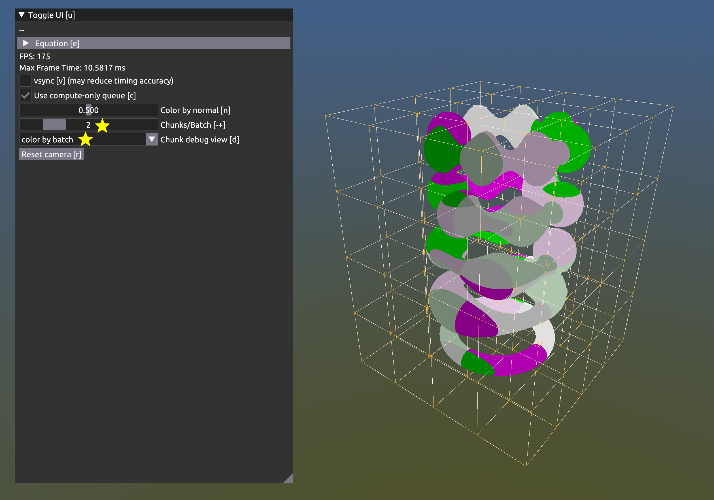
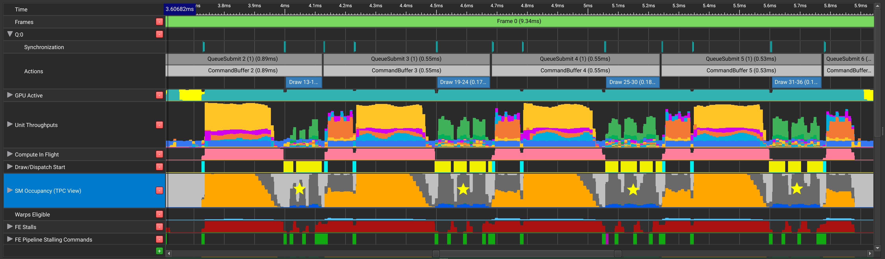
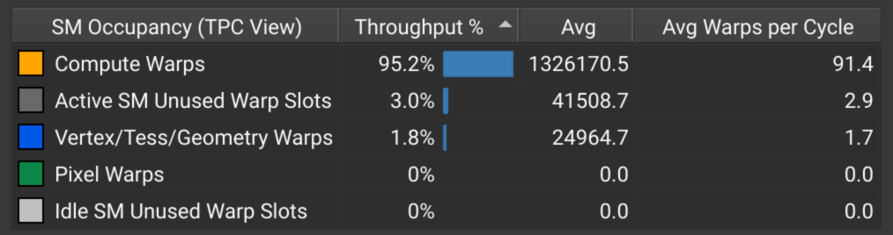
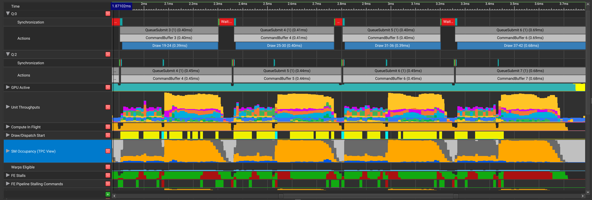

# vk_timeline_semaphore

This sample provides a concrete example of how timeline semaphores and
asynchronous compute-only queues can be used to speed up a
heterogeneous compute/graphics Vulkan application.

# Build and Run

Clone https://github.com/nvpro-samples/nvpro_core.git next to this
repository (or pull latest `master` if you already have it)

`mkdir build && cd build && cmake .. # Or use CMake GUI`

If there are missing dependencies (e.g. glfw), run `git submodule
update --init --recursive --checkout --force` in the `nvpro_core`
repository.

Then start the generated `.sln` in VS or run `make -j`.

Run `vk_timeline_semaphore` or
`../../bin_x64/Release/vk_timeline_semaphore.exe`

# Timeline Semaphore Summary

*Please skip this section if you are already familiar with timeline
 semaphores and their benefits over binary semaphores.*

[`VK_KHR_timeline_semaphore`](https://www.khronos.org/registry/vulkan/specs/1.2-extensions/man/html/VK_KHR_timeline_semaphore.html)
introduces a new type of semaphore that has more functionality over
the default "binary" semaphore introduced in the original Vulkan. This
feature is core in Vulkan 1.2, although it requires the
[`timelineSemaphore`
feature](https://www.khronos.org/registry/vulkan/specs/1.2-extensions/man/html/VkPhysicalDeviceVulkan12Features.html).

The original binary semaphore has only two states: signaled and
unsignaled, and two possible operations: signalling it upon the
completion of a queue submit, and waiting on it (device-side) before
starting a pending queue submit (implicitly resetting the semaphore to
the unsignaled state). This causes some limitations:

* If the user recycles a binary semaphore, they should take care that
  the semaphore strictly alternates between being signalled and being
  waited on (i.e. that the producer does not "overshoot" and signal
  the semaphore again before the consumer waits and resets the
  semaphore).

* The implicit unsignal operation makes it impossible to use a single
  binary semaphore to unblock two queues at once (e.g. graphics and
  compute both waiting for the same transfer command to finish).

Furthermore, the spec requires that before submitting any work that
waits on a binary semaphore, the work that signals said semaphore must
be submitted first.  These limitations generally have the consequence
of making it cumbersome to implement fine-grained dependencies with
binary semaphores.

Instead of only having 1 bit of state, timeline semaphores have an
internal 64-bit unsigned integer counter. Each signal and wait
operation requires an additional 64-bit unsigned parameter, which

* for signals, indicates the new value to set the counter to, subject
  to the restriction that this value must be strictly greater than
  the semaphore's value at the time the signal operation executes.

* for waits, indicates the *minimum value* of the timeline semaphore
  such that the waiting operation may proceed.

This makes timeline semaphores a natural choice for expressing
fine-grained producer/consumer dependencies: because the wait only
requires a minimum value to proceed, and the value strictly increases,
there is no "overshoot" risk of the kind that binary semaphores have.

Further features of timeline semaphores include:

* Timeline semaphores may also be
  [signalled](https://www.khronos.org/registry/vulkan/specs/1.2-extensions/man/html/vkSignalSemaphoreKHR.html)
  and [waited
  on](https://www.khronos.org/registry/vulkan/specs/1.2-extensions/man/html/vkWaitSemaphoresKHR.html)
  by the host, taking the place of fences and events.

* Timeline semaphores do not have any restrictions on the order that
  dependent work is submitted. Of course, you still risk resetting the
  GPU if you introduce circular dependencies, or introduce an extreme
  delay between submitting dependent work, and submitting its
  dependencies.

Unfortunately, at the time of writing, timeline semaphores cannot be
used to synchronize with the swapchain. Thus most Vulkan programs
cannot standardize completely on timeline semaphores.

# Motivation

As a stand-in for the sort of heterogenous work a Vulkan application
may need to synchronize, the sample implements an approximate
[implicit surface
renderer](https://en.wikipedia.org/wiki/Implicit_surface) using the
[marching cubes
algorithm](https://en.wikipedia.org/wiki/Marching_cubes). Understanding
the details of the algorithm is not neccessary to understand the
synchronization this is demonstrating; in summary, the steps are:

1. Generating a 3D sample grid of values by evaluating a scalar
   equation `F(x,y,z)` at each coordinate. This is done by compute
   shader, with the results stored to a `VkImage` with
   `VK_IMAGE_TYPE_3D`.

2. Generating a vertex buffer by having a compute shader analyze each
   cubical "cell" of 8 neighboring samples. The compute shader outputs
   triangles for each cell where samples transition from positive to
   negative, thus approximating the implicit `F(x,y,z)=0` boundary
   between the positive and negative regions.

3. Using a graphics pipeline to draw the generated triangles.

Synchronization is needed between each step. Furthermore, this
algorithm is very memory intensive – both the 3D image and vertex
buffer take up huge amounts of VRAM – so to render at a good
resolution, we will have to split the model into chunks, and perform
these steps separately for each chunk. This requires an additional
synchronization from step 3 to step 1, so that the computed results
aren't overwritten before they are fully drawn (i.e. to resolve the
[WAR
hazard](https://en.wikipedia.org/wiki/Hazard_(computer_architecture)#Write_after_read_(WAR))).

*Visualization of model split into 4×4×4 grid of chunks*

One way to implement this would be to submit commands for all three
steps to a single GCT queue (graphics/compute/transfer), inserting
pipeline barriers for synchronization. The downsides to this approach
are:

* Since there is only one queue being used, the device work completely
  drains at each barrier, with no alternative work to do to alleviate
  this waste.

* We will see later on that the graphics work in this sample is very
  light in terms of SM usage; the device is seriously underutilized
  when working solely on step 3.

A better alternative would be to move steps 1 and 2 to a dedicated compute
queue, and use timeline semaphores to handle the RAW hazard (steps 2 to 3)
and WAR hazard (steps 3 to 1). The theoretical benefits of this are

* We still have a pipeline barrier from step 1 to step 2; the dip in
  compute utilization will not completely bring the device to 0
  utilization since the separate graphics queue's work can "fill in
  the gap" (although the lightness of this work somewhat limits this
  effect).

* The compute work can proceed in parallel with the graphics work and
  take advantage of the SMs that the graphics work underutilizes.

Later we will see how these theoretical benefits translate to actual
better performance.

## Implementation

In the code, the data structure that holds the 3D image and vertex
buffer used for communicating between the steps of the marching cubes
algorithm is called `McubesChunk`, implemented in `mcubes_chunk.cpp`.
We allocate on startup a pool of `MCUBES_CHUNK_COUNT`-many such
structures, held in `g_mcubesChunkArray`. We treat this array as a
[ring buffer](https://en.wikipedia.org/wiki/Circular_buffer), picking
the next in the buffer each time we record a new command to fill or
draw an `McubesChunk` instance.

The central function to look at for this sample is
`computeDrawCommandsTwoQueues` in `timeline_semaphore_main.cpp`, which
does the task of recording and submitting the compute and graphics
commands for a frame. To keep the focus on timeline semaphores, the
details for these commands are moved to `compute.cpp` and
`graphics.cpp`.

We've allocated two timeline semaphores:
`s_computeDoneTimelineSemaphore`, for resolving the RAW hazard
(compute queue produced vertex buffer → graphics queue draw) and
`s_graphicsDoneTimelineSemaphore` for resolving the WAR hazard
(graphics queue done drawing → compute queue refills). This is done
with the same `vkCreateSemaphore` API, but with an additional
[`VkSemaphoreTypeCreateInfo`](https://www.khronos.org/registry/vulkan/specs/1.2-extensions/man/html/VkSemaphoreTypeCreateInfo.html)
on the `pNext` chain.

    // Allocate the timeline semaphores; initial value 0. Need extension struct for this.
    VkSemaphoreTypeCreateInfo timelineSemaphoreInfo = {VK_STRUCTURE_TYPE_SEMAPHORE_TYPE_CREATE_INFO, nullptr,
                                                       VK_SEMAPHORE_TYPE_TIMELINE, 0};
    VkSemaphoreCreateInfo     semaphoreInfo         = {VK_STRUCTURE_TYPE_SEMAPHORE_CREATE_INFO, &timelineSemaphoreInfo};
    NVVK_CHECK(vkCreateSemaphore(g_ctx, &semaphoreInfo, nullptr, &s_computeDoneTimelineSemaphore));
    NVVK_CHECK(vkCreateSemaphore(g_ctx, &semaphoreInfo, nullptr, &s_graphicsDoneTimelineSemaphore));

These semaphores are passed as parameters of a
[`VkQueueSubmit`](https://www.khronos.org/registry/vulkan/specs/1.2-extensions/man/html/vkQueueSubmit.html)
in the same way as binary semaphores, except that there is an
additional
[`VkTimelineSemaphoreSubmitInfo`](https://www.khronos.org/registry/vulkan/specs/1.2-extensions/man/html/VkTimelineSemaphoreSubmitInfo.html)
extension struct to provide the array of 64-bit counter value parameters.

    uint64_t                      computeWaitTimelineValue = 0, computeSignalTimelineValue = 0;
    uint64_t                      graphicsWaitTimelineValue = 0, graphicsSignalTimelineValue = 0;
    VkTimelineSemaphoreSubmitInfo computeTimelineInfo = {
        VK_STRUCTURE_TYPE_TIMELINE_SEMAPHORE_SUBMIT_INFO,
        nullptr,
        1,
        &computeWaitTimelineValue,  // Compute queue waits for /at least/ this timeline semaphore value of
        1,                          // s_graphicsDoneTimelineSemaphore (semaphore set below).
        &computeSignalTimelineValue};
    // ...
    // analagous for graphicsTimelineInfo
    VkSubmitInfo computeSubmitInfo  = {VK_STRUCTURE_TYPE_SUBMIT_INFO,
                                      &computeTimelineInfo,  // Extension struct
                                      1,
                                      &s_graphicsDoneTimelineSemaphore,  // Compute waits for graphics queue
                                      &computeStage,                     // Waits for semaphore before starting compute
                                      1,
                                      &batchComputeCmdBuf,
                                      1,
                                      &s_computeDoneTimelineSemaphore};

Once the model is subdivided into chunks, the list of chunks to draw
is divided into batches of up to `pGui->m_batchSize` chunks each. This
is the amount of work that one compute or one graphics command buffer
will do. Each batch compute/graphics submit increments the values of
the corresponding timeline semaphore (orchestrated by the
`s_upcomingTimelineValue` variable), so, the batch size in some sense
is the granularity of synchronization.

The pattern for the RAW synchronization (compute → graphics) is
straightforward: the graphics command buffer submitted for a batch
waits on the `s_computeDoneTimelineSemaphore` value set by the compute
command buffer for the same batch. So, the graphics work for a batch
can proceed immediately after the compute work for the batch is
complete.

    computeSignalTimelineValue = s_upcomingTimelineValue;  // Recall pointer to this value in VkTimelineSemaphoreSubmitInfo above
    NVVK_CHECK(vkQueueSubmit(g_computeQueue, 1, &computeSubmitInfo, VkFence{}));
    // ...
    graphicsWaitTimelineValue = s_upcomingTimelineValue;
    // ...
    NVVK_CHECK(vkQueueSubmit(g_gctQueue, 1, &graphicsSubmitInfo, VkFence{}));

The pattern for the WAR synchronization (graphics → compute) is a bit
more interesting. We need to record, for each `McubesChunk`, when it
will be fully drawn and ready for recycling. So, each time an
`McubesChunk` is used in a graphics batch, we record the value that
`s_graphicsDoneTimelineSemaphore` will be set to by the signal
operation of that batch. This is stored in
`McubesChunk::timelineValue`.

Then, when recording the newer compute batch, for each `McubesChunk`
selected for use, we have to wait for
`s_graphicsDoneTimelineSemaphore` to reach the value recorded in
`McubesChunk::timelineValue`; more optimally, we just have to wait for
the maximum `McubesChunk::timelineValue` of all `McubesChunk`
instances selected.

*Setting `McubesChunk::timelineValue`*

    // Graphics commands.
    for(uint32_t localIndex = 0, paramIndex = batchStart; paramIndex < batchEnd; ++paramIndex, ++localIndex)
    {
      // Record the s_graphicsDoneTimelineSemaphore value for this McubesChunk that indicates readiness for recycling.
      chunkPointerArray[localIndex]->timelineValue = s_upcomingTimelineValue;
    }
    // ...
    graphicsCmdDrawMcubesGeometryBatch(batchGraphicsCmdBuf, batchEnd - batchStart, chunkPointerArray, /* ... */);
    // ...
    graphicsSignalTimelineValue = s_upcomingTimelineValue;
    NVVK_CHECK(vkQueueSubmit(g_gctQueue, 1, &graphicsSubmitInfo, VkFence{}));

*Waiting on maximum `McubesChunk::timelineValue` value*

    // Record compute commands.
    // We also keep track of the s_graphicsDoneTimelineSemaphore value that these compute commands
    // need to wait on (to safely recycle the McubesChunk).
    for(uint32_t localIndex = 0, paramIndex = batchStart; paramIndex < batchEnd; ++paramIndex, ++localIndex)
    {
      computeWaitTimelineValue = std::max(computeWaitTimelineValue, chunkPointerArray[localIndex]->timelineValue);
    }
    computeCmdFillChunkBatch(batchComputeCmdBuf, batchEnd - batchStart, chunkPointerArray, &paramsList[batchStart]);
    // recall computeWaitTimelineValue is pointed-to by computeTimelineInfo (VkTimelineSemaphoreSubmitInfo).

NOTE: We use `timelineValue = 0` as a safe value for `McubesChunk`
instances that have never been drawn as `x >= 0` for all possible
unsigned timeline semaphore values `x`.

The `s_computeDoneTimelineSemaphore` only handles the execution order
dependency. We still need a pipeline barrier to handle the memory
dependency (in hardware terms, flushing caches, etc.). This is the
command executed in the *graphics* command buffer for each batch,
before any `McubesChunk`-drawing commands.

    // Ensure memory dependency resolved between upcoming compute command and upcoming graphics commands.
    // This is separate from (and an additional requirement on top of) the execution dependency
    // handled by the timeline semaphore.
    // No queue ownership transfer -- using VK_SHARING_MODE_CONCURRENT.
    VkMemoryBarrier computeToGraphicsBarrier = {VK_STRUCTURE_TYPE_MEMORY_BARRIER, nullptr, VK_ACCESS_SHADER_WRITE_BIT,
                                                VK_ACCESS_INDIRECT_COMMAND_READ_BIT | VK_ACCESS_SHADER_READ_BIT};
    vkCmdPipelineBarrier(batchGraphicsCmdBuf, computeStage, readGeometryArrayStage, 0, 1, &computeToGraphicsBarrier, 0, 0, 0, 0);

*Note that this is not just a theoretical concern!* The author failed
 to include this barrier at first, and experienced sporadic
 corruption.

We do not need a memory barrier for the other direction (graphics to
compute WAR hazard) because we are going to overwrite the
`McubesChunk` contents anyway.

---

For comparison, an implementation using only one queue and pipeline
barriers is in the `computeDrawCommandsGctOnly` function in
`timeline_semaphore_main.cpp`.

Note that for both the `computeDrawCommandsTwoQueues` and
`computeDrawCommandsGctOnly` code path, we are using a separate
`submitFrame` function to do the task of acquiring/submitting swap
chain images, and copying the drawn image to the swap chain. As
mentioned before, this must still use binary semaphores, and hence,
the programmer must follow its in-order submisison requirements and
ensure that all command buffers for the frame have already been
submitted. This is simple for this sample, but more care would need to
be taken if some command recording were moved to another thread.

---

There are some debug views for visualizing the chunking and batching
algorithm.

First, we can visualize how chunks are packed into batches; all chunks
in a given batch use the same color: 

Contrast with the view if the batch size is reduced to 2 chunks:

Second, we can color based on the physical `McubesChunk` instance used
to draw each chunk. Each instance is assigned a unique color: 

Observe how multiple different chunks can be in the same color. This
indicates that we've successfully recycled `McubesChunk` instances in
a single frame, and the lack of corruption suggests the data hazards
were properly resolved.

## Results

On a release build running on Ubuntu 18.04 and an RTX 3090, we are getting
around 230 FPS with the default settings, compared to around 200 FPS with
the async compute queue disabled (toggle with `c` key).

We can take a look at what's really going on using [Nsight Graphics
GPU
Trace](https://docs.nvidia.com/nsight-graphics/UserGuide/#gpu_trace_0).

With the async compute queue **disabled**, we see:

Paying attention to the "SM Occupancy" row, we see that there are
periodic dips in utilization, corresponding to the graphics work of
each batch.

*Color Key for SM Occupancy*

When we enable the async compute queue, we see:

The SM occupancy in this case is not perfect either, but is a serious
improvement over using only one queue: we can see that the (orange)
compute work is proceeding more smoothly, and has successfully been
overlapped with the (blue) graphics shader work.

*Note:* On some older versions of Nsight Graphics, timeline semaphore
 synchronization is mislabelled as fence synchronization.

## Acknowledgement

Thank you to Christoph Kubisch for spotting the missing memory
barrier, Neil Bickford for edits and review.

## License

Copyright 2021 NVIDIA CORPORATION. Released under Apache License,
Version 2.0. See "LICENSE" file for details.